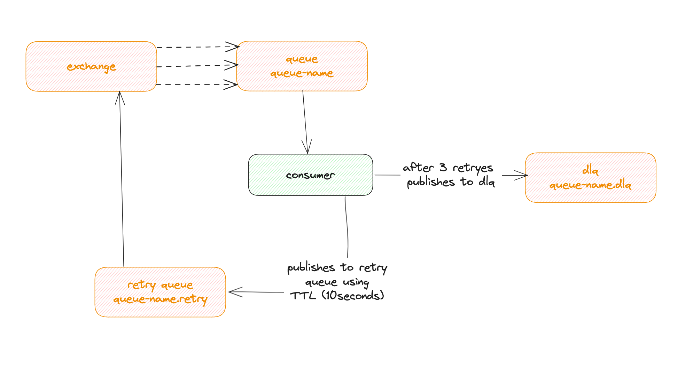

# Smart Billing System

## Descrição do Projeto
Sistema assíncrono de processamento de arquivos CSV para geração automatizada de boletos. O sistema processa arquivos de forma distribuída, utilizando filas para garantir escalabilidade e resiliência.

## Arquitetura

### Visão Geral
O sistema utiliza uma arquitetura orientada a eventos, com processamento assíncrono distribuído através do RabbitMQ. A arquitetura foi projetada para ser escalável e resiliente, permitindo o processamento de grandes volumes de dados de forma eficiente.





### Componentes Principais
- **API Upload**: Endpoint para recebimento de arquivos CSV
- **File Processor**: Responsável por dividir arquivos em chunks
- **Chunk Processor**: Processa e valida dados, salvando no banco
- **Boleto Generator**: Gera boletos para as dívidas processadas
- **Notification Service**: Envia notificações aos usuários

### Fluxo de Dados
1. Upload do arquivo CSV
2. Divisão em chunks para processamento paralelo
3. Validação e armazenamento dos dados
4. Geração de boletos
5. Notificação dos usuários

## Pontos em consideração
No arquivo há duplicidade de email e government id. tem que ser levando em consideraçao os dois ou apenas um para controlar duplicidade?
estou colocando apenas pro government_id, pois o cpf so existe 1, mas a mesma pessoa pode ter mais de um email, correto pensar assim?

### Prós e Contras

#### Prós
- Escalabilidade horizontal
- Processamento distribuído
- Resiliência a falhas
- Baixo acoplamento entre componentes
- Facilidade de manutenção e extensão
- Monitoramento granular

#### Contras
- Complexidade de infraestrutura
- Necessidade de gerenciamento de múltiplos componentes
- Eventual consistência dos dados
- Complexidade no tratamento de erros distribuídos

## Melhorias Futuras
- Separaçao em microserviços. Atualmente o projeto esta todo criado numa unica aplicaçao para conseguir entregar o desafio no tempo adequadro. No entando o ideal é que haja uma separaçao em microserviços para cada etapa do processo: Upload de arquivo, Processamento do arquivo, Geraçao de boleto, Central de Notificaçao. Assim como também cabe uma separaçao de banco de dados.
- Criaçao de variaveis de ambiente.
- Criaçao de banco de dados para teste.
- Melhor abstraçao para criaçao de logs de exceçao. 

## Ajustes Necessários
- Ajustar inicializaçao do docker compose para que a aplicaçao so inicialize após o rabbitmq estiver rodando.
Atualmente, apesar de estar criado com `depends_on` há algum problema que não está obedecendo e a aplicaçao da um erro, pois logo na inicializaçao ela faz a criaçao dos consumers, exchanges, filas e bindings.
- Apesar dos logs estarem todos configurados com logstash, prometheus e ELK stack, os logs feitos pelo loguru, não estão sendo enviados ao prometheus, o que acaba nao populando os logs no prometheus e ELK stack.
- Por os testes estarem rodando por fora do container, o host de acesso do broker esta diferente, sendo acessado por dentro do container com `rabbitmq` e por fora do container com `localhost`. A Aplicaçao nao esta configurada para atender este ponto, ao rodar os testes de integraçao precisasse que altere manualmente o host do rabbitmq.

## Stack Tecnológica

### Backend
- **FastAPI**: Framework web assíncrono de alta performance
- **SQLAlchemy**: ORM para interação com banco de dados
- **Pydantic**: Validação de dados e serialização
- **aio-pika**: Cliente assíncrono para RabbitMQ
- **asyncpg**: Driver PostgreSQL assíncrono
- **alembic**: Migrações de banco de dados

### Infraestrutura
- **PostgreSQL**: Banco de dados principal
- **RabbitMQ**: Message broker
- **Docker**: Containerização
- **Docker Compose**: Orquestração de containers

### Monitoramento
- **Prometheus**: Coleta de métricas
- **Grafana**: Visualização de métricas
- **ELK Stack**: Log aggregation e análise
  - Elasticsearch
  - Logstash
  - Kibana

## Endpoints e Interfaces

### API
- FastAPI Swagger UI: `http://localhost:8000/docs`
- API Base URL: `http://localhost:8000`

### Monitoramento
- Grafana: `http://localhost:3000`
- Prometheus: `http://localhost:9090`
- Kibana: `http://localhost:5601`
- RabbitMQ Management: `http://localhost:15672`

## Configuração e Instalação

### Pré-requisitos
- Docker
- Docker Compose

### Instalação
```bash
# Clone o repositório
git clone [git@github.com:renankcb/smart-billing-processor.git]

# Entre no diretório
cd smart-billing

# Inicie os containers
docker-compose up -d

# Verifique os logs
docker-compose logs -f
```

### Configuração de Desenvolvimento
```bash
# Instale as dependências
pip install -r requirements.txt

# Execute as migrações
alembic upgrade head

# Inicie o servidor de desenvolvimento
uvicorn app.main:app --reload
```

## Testes
```bash
# Execute os testes
pytest

# Execute os testes com cobertura
pytest --cov=app
```

## Monitoramento e Logs 
Como mencionado na sessão de ajustes necessários, há um problema onde os logs nao estao sendo enviados ao prometheus, e com isso nao conseguimos visualizar as métricas. Por enquanto fica visivel apenas nos logs da aplicaçao.

### Métricas Disponíveis
- Taxa de processamento de arquivos
- Tempo médio de processamento
- Taxa de erros
- Uso de recursos do sistema

### Logs
- Todos os logs são centralizados no ELK Stack
- Visualização através do Kibana
- Logs estruturados com contexto enriquecido
